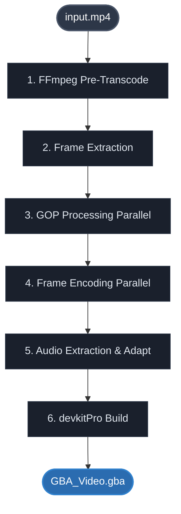

<p align="center"></p>
<div align="center">
  <a href="https://discord.gg/wsFFExCWFu"></a>
  
  
  
</div>

## GBA Video Studio

**GBA Video Studio** is a desktop application for converting and playing video on the **Game Boy Advance**. It converts any video file into a `.gba` ROM that plays directly on hardware or emulator, with a full visual editor for trimming, previewing, and configuring every encoding parameter.

> ⚠️ Designed for GBA developers and ROM hackers who need precise control over video encoding for the GBA hardware.

---

## 🌐 Translations

This README is available in the following languages:

<p align="center">
  <a href="README.md">English</a> | <a href="docs/README.spa.md">Español</a> | <a href="docs/README.brp.md">Português (BR)</a> | <a href="docs/README.fra.md">Français</a> | <a href="docs/README.deu.md">Deutsch</a> | <a href="docs/README.ita.md">Italiano</a> | <a href="docs/README.por.md">Português</a> | <a href="docs/README.nld.md">Nederlands</a> | <a href="docs/README.pol.md">Polski</a><br>
  <a href="docs/README.tur.md">Türkçe</a> | <a href="docs/README.vie.md">Tiếng Việt</a> | <a href="docs/README.ind.md">Bahasa Indonesia</a> | <a href="docs/README.hin.md">हिन्दी</a> | <a href="docs/README.rus.md">Русский</a> | <a href="docs/README.jpn.md">日本語</a> | <a href="docs/README.zhs.md">简体中文</a> | <a href="docs/README.zht.md">繁體中文</a> | <a href="docs/README.kor.md">한국어</a>
</p>

---

## ✨ Features

- **Video to GBA conversion**
  - Converts any video file into a playable GBA ROM.
  - YUV444 color space with VQ codebook compression per GOP.
  - Optional Floyd-Steinberg dithering for reduced banding.
  - Letterbox, stretch, or custom crop before encoding.

- **Visual editor**
  - Load and preview any video file with full playback controls.
  - Set start/end markers to encode only a selected range.
  - Real-time GBA output preview (240×160) with letterbox and crop applied.

- **Encoding profiles (presets)**
  - Six built-in presets: Default, Balanced, High Quality, Low FPS, Fast Encode, No Audio.
  - Save, reload, and manage custom user presets.
  - Full parameter control: FPS, codebook size, K-means iterations, I-frame interval, motion compensation, and more.

- **Audio support**
  - **PCM**: 8-bit signed mono, any sample rate 6500–44100 Hz. Full seeking support.
  - **ADPCM**: IMA ADPCM 4-bit (~50% smaller), snapped to GBA nice rates. Seeking disabled.
  - Volume adjustment and no-audio mode.

- **Decompilation project integration**
  - Outputs ready-to-use `video.c`, `video.h`, and binary assets for pret projects (pokefirered, pokeemerald, etc.).
  - Configurable skip key (`VIDEO_SKIP_KEY`).
  - See [`INTEGRATION.md`](INTEGRATION.md) for integration steps.

- **Multi-language UI**
  - 18 languages supported. Language can be changed at runtime without restarting.

- **Post-export actions**
  - Optionally shut down, sleep, hibernate, lock, log off, or quit after encoding completes.

---

## 🖼️ Screenshots

<p align="center"></p>

<p align="center"></p>

---

## 🔄 How It Works

The conversion pipeline is optimized for high-performance video encoding, leveraging parallel processing and memory mapping (`memmap`) to handle heavy video files without RAM accumulation.



### 🛠️ The Pipeline Breakdown

#### 1. FFmpeg Pre-Transcode

* **Geometry:** Optional cropping $\rightarrow$ hard resize to **240×160** (supports letterboxing or stretching).
* **Timing:** Frame rate conversion to exact GBA-native FPS targets.
* **Trimming:** Precise timeline seeking via optional start-time parameters.

#### 2. Frame Extraction & Color Management

* **Color Space:** Extracted directly into **YUV444** color space.
* **Dithering:** Optional **Floyd-Steinberg** spatial error diffusion for optimal 15-bit color representation.
* **Memory Footprint:** Frames are streamed directly into a disk-backed `memmap` matrix, ensuring **0% RAM accumulation** even on hour-long videos.

#### 3. GOP (Group of Pictures) Processing `Parallel`

* **Segmentation:** Video is sliced into independent GOPs consisting of one **I-frame** followed by multiple **P-frames**.
* **Quantization:** Trains a localized Vector Quantization (VQ) codebook per GOP using the **K-means** clustering algorithm.
* **Optimization:** Codebooks are automatically sorted by structural usage frequency to minimize indexing overhead.

#### 4. Frame Encoding `Parallel`

* **I-Frames:** Encoded using full-frame spatial data combined with the local VQ codebook.
* **P-Frames:** Temporal compression that only stores delta blocks (changed areas) and motion vectors relative to the previous frame.

#### 5. Audio Extraction & Adaptability

* **PCM Mode:** Crisp, uncompressed mono signed 8-bit audio at your chosen sample rate.
* **ADPCM Mode:** Compressed 4-bit IMA ADPCM, mathematically snapped to the nearest GBA-friendly playback rate to avoid resampling stutter.

#### 6. Compilation

* The asset compiler bundles the encoded video, audio binary, and playback engine components.
* Automatically invokes **devkitPro / make** to link everything into a bare-metal, hardware-compliant `GBA_Video.gba` ROM.

---

## 📊 Encoding Parameters

### Video

| Parameter | Default | Range | Effect |
|---|---|---|---|
| Target FPS | 9.9546 | 5.97 – 14.93 | Higher = smoother, larger file |
| I-frame Interval | 60 | 1–999 | Shorter = better seek, larger file |
| Diff Threshold | 2.5 | 0.0–50.0 | Lower = sharper, larger file |
| Variance Threshold | 10.0 | 0.0–100.0 | Separates flat vs. texture blocks |
| Color Fallback | 10.0 | 0.0–100.0 | Flat-block fallback distance |
| Force I Threshold | 0.7 | 0.0–1.0 | Scene-change I-frame sensitivity |
| Codebook Size | 256 | 2–256 | Larger = better quality |
| K-means Iterations | 200 | 1–2000 | More = better quality, slower |
| I-frame Weight | 3 | 1–10 | I-frame block weight in clustering |
| Motion Threshold | 6 | 0–16 | Max 2×2 sub-blocks updated per 8×8 MC block |
| Dithering | on | on/off | Floyd-Steinberg, negligible size difference |
| Motion Compensation | on | on/off | Disable for faster encode, larger P-frames |

### Audio

| Parameter | Default | Range |
|---|---|---|
| Format | PCM | PCM / ADPCM |
| Sample Rate | 18157 Hz | 6500–44100 Hz |
| Volume | 100% | 0–200% |

### GBA-native FPS values

| FPS | Use case |
|-----|----------|
| 5.9727 | Minimum size |
| 6.6364 | Very compact |
| 7.4659 | Compact |
| 8.5325 | Moderate |
| **9.9546** | **Default — best balance** |
| 11.9455 | Smooth motion |
| 14.9319 | Maximum (high motion content) |

---

## 📦 File Size Reference

| FPS | Video/min | PCM 18157 Hz | ADPCM 18157 Hz | No audio |
|-----|-----------|--------------|----------------|----------|
| 14.9319 | ~6.0 MB | ~6.9 MB | ~6.5 MB | ~6.0 MB |
| **9.9546** | **~4.2 MB** | **~5.0 MB** | **~4.6 MB** | **~4.2 MB** |
| 5.9727 | ~2.5 MB | ~3.3 MB | ~3.0 MB | ~2.5 MB |

32 MB cartridge capacity (approx.):

| FPS | PCM 18157 Hz | ADPCM 18157 Hz | No audio |
|-----|--------------|----------------|----------|
| 14.9319 | ~4:45 | ~5:00 | ~5:30 |
| 9.9546 | ~6:30 | ~7:00 | ~7:45 |
| 5.9727 | ~9:45 | ~10:45 | ~12:45 |

---

## 🎮 GBA Controls (standalone ROM)

| Button | PCM | ADPCM |
|--------|-----|-------|
| START / A — Pause / Resume | ✓ | ✓ |
| B — Mute / Unmute | ✓ | ✓ |
| RIGHT — Fast forward 3s | ✓ | ✗ |
| LEFT — Rewind 3s | ✓ | ✗ |
| SELECT — Lock / unlock controls | ✓ | ✓ |

> Seek (LEFT/RIGHT) is not available in ADPCM because the IMA ADPCM predictor is cumulative — jumping to an arbitrary byte offset without warm-up would produce corrupted audio.

---

## 🏗️ Architecture Overview

Built with **Python** and **PySide6 / PySide2** (auto-detected by Python version):

- **`VideoEditor`** — main window, manages video loading, preview, and export.
- **`VideoController`** — OpenCV-based playback with frame-accurate seeking.
- **`PresetManager`** — built-in and user-defined encoding presets.
- **`VideoEncoderCore`** — GOP-parallel VQ encoder (K-means + motion compensation).
- **`AudioEncoder`** — PCM / IMA ADPCM extractor via bundled ffmpeg (imageio-ffmpeg).
- **`Translator` / `ConfigManager`** — runtime language switching and persistent config.

---

## 📦 Installation

### Option 1 — Installer (recommended)

Download from [GitHub Releases](https://github.com/CompuMaxx/GBA-Video-Studio/releases):

| Installer | Python | OS |
|---|---|---|
| `GBAVideoStudio_Setup.exe` | Bundled | Windows 10 / 11 |
| `GBAVideoStudio_Legacy_Setup.exe` | Bundled | Windows 7 / 8 / 8.1 |

### Option 2 — Portable

Download `GBAVideoStudio_Portable.7z` from [GitHub Releases](https://github.com/CompuMaxx/GBA-Video-Studio/releases), extract anywhere and run `GBAVideoStudio.exe`. No installation required.

| Archive | Python | OS |
|---|---|---|
| `GBAVideoStudio_Portable.7z` | Bundled (PySide2) | Windows 7+ |

> The portable build registers its location in the Windows registry on first launch so the built-in updater can locate it regardless of where it is extracted.

---

### Option 3 — Run from source

#### Requirements

| Environment | Python | Qt Backend |
|---|---|---|
| Modern | 3.10+ | PySide6 (auto) |
| Legacy | 3.8 / 3.9 | PySide2 5.15.2 (auto) |

#### External tools

- **devkitPro** — install `gba-dev` group from [devkitpro.org](https://devkitpro.org/wiki/Getting_Started) (required only for ROM compilation — video conversion works without it)

> ffmpeg is bundled automatically via `imageio-ffmpeg` — no separate installation required.

#### Steps

```bash
git clone https://github.com/CompuMaxx/GBA-Video-Studio.git
cd GBA-Video-Studio
python -m venv .venv
# Windows:
.venv\Scripts\activate
pip install -r requirements.txt
python main.py
```

---

## 🚀 Quick Start

1. **Open a video** — File → Open Video or `Ctrl+O`.
2. **Set range** (optional) — navigate to start frame, press `Ctrl+PageUp`; navigate to end frame, press `Ctrl+PageDown`.
3. **Configure output filters** — enable/disable Letterbox, set Crop (`x,y,w,h`), click Apply Filters to preview.
4. **Choose a preset** — pick from the Preset dropdown (Default, Balanced, High Quality, Low FPS, Fast Encode, No Audio) or tune individual parameters.
5. **Select output folder** — click Browse.
6. **Build ROM** — click Build ROM. Progress and elapsed time are shown in the status bar.
7. **Done** — a popup shows memory usage (ROM / EWRAM / IWRAM). The `.gba` file is in your output folder.

---

## 🧩 Decompilation Project Integration

After encoding, the `output/` folder contains everything needed to embed the video in a pret decomp project:

```
output/
  graphics/video/     → copy to <project>/graphics/video/  (regenerated each encode)
  include/video.h     → copy to <project>/include/video.h  (regenerated each encode)
  src/video.c         → copy to <project>/src/video.c      (copy once)
  INTEGRATION.md
```

See [`INTEGRATION.md`](INTEGRATION.md) for the full integration guide, Task API reference, and skip key configuration.

---

## ⚙️ Configuration & Localization

- Settings are stored in `config.ini` and persist across sessions (language, output folder, preview mode, max workers, default preset, etc.).
- Language can be changed at runtime via **Settings → Language** — all UI strings update immediately including video info, preset names, and memory table headers.

---

## 🤝 Contributing

1. Fork this repository.
2. Create a feature branch: `git checkout -b feature/my-feature`
3. Commit your changes: `git commit -am "Add my feature"`
4. Push: `git push origin feature/my-feature`
5. Open a Pull Request.

---

## 🙏 Acknowledgments

- **[Ausar's GBA Video Player](https://github.com/ArcheyChen/gba_video)** by ArcheyChen — Architectural inspiration for the video playback. The engine used here features custom bug fixes and critical IWRAM/EWRAM optimizations.
- **[8ad ADPCM codec](https://pineight.com/gba/#8ad)** by Damian Yerrick ("PinoBatch") — Conceptual basis for the IMA ADPCM audio support, optimized for better memory performance.

---

## 📄 License

Licensed under the **GNU General Public License v3.0 (GPL-3.0)**.
Derivative projects must be open source. See [LICENSE](LICENSE) for details.

---

## 📩 Contact & Support

<p align="left">
  <a href="https://discord.gg/wsFFExCWFu">
    
  </a>
</p>

If you find this tool useful, consider supporting its development:

[](https://ko-fi.com/compumax)
